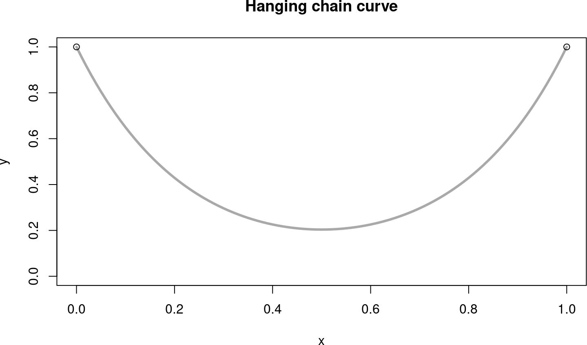
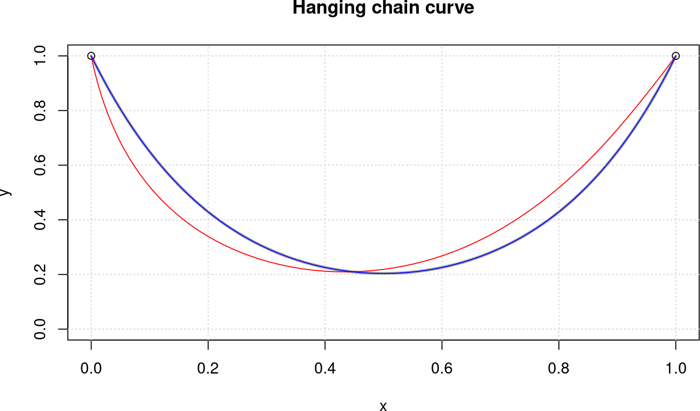
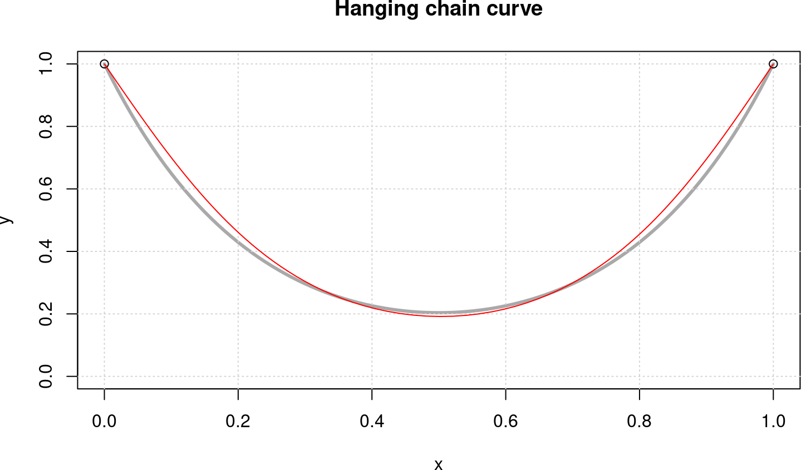

# Introduction

I was thinking about a good test case to evaluate different versions of `auglag`, say with `optim`, `nlminb`, or `ucminf`. I found the *catenary* curve to be a good one. The aim is to solve the "hanging chain" problem not as a differential equation, but as an optimization problem.


## The theoretical solution

First we reproduce the exact solution for a chain of length $L = 2$ in the $(x,y)$-plane, from $(0,0)$ to $(1,0)$. The theoretical solution is
$$
  y = a\,\cosh(\frac{x}{a})
$$
where the distance $w$ between the fixed points, the length $L$ of the chain, and the *curvature radius* $a$ are related to each other through
$$
  L = 2 a\,\sinh(\frac{w}{2a})
$$

We calculate the parameter $a$ in R as a solution of this as a function in $a$:

```r
w <- 1; L <- 2
fun <- function(x) L - 2*x*sinh(w/(2*x))
aa <- uniroot(fun, c(0.1, 0.5))$root        # 0.22965
```

The chain curve is symmetric around $0.5$ and the fixed points shall have a height of 1.0 above the ground.

```r
bb <- aa * cosh(0.5/aa)                        # 0.02597928
cy <- function(x) aa * cosh((x - 0.5)/aa) - bb + 1.0
```

<!-- -->


## The catenary as an optimization problem

So we are assuming a chain of length 2 is bound to the points $P1 = (0,1)$ and $P2 = (1,1)$ with gravitational force acting in negative y-direction. 


```r
N <- 101        # no. of points
L <- 2          # total length of chain
h <- L / (N-1)  # maximal length of each chain link
```

The decision variables are the x- and y-coordinates of the beginning and end of the chain elements. We will look at the cases of 101 points, that is 100 chain links.

The parameter vector `c(x, y)` has dimension $2 N$, the concatenated vector of x- and y-coordinates. The objective function is simply to minimize the potential energy.


```r
fnobj <- function(p)  sum(p[(N+1):(2*N)])  # sum(y)

grobj <- function(p)  c(rep(0, N), rep(1, N))
```

We will use the exaxt gradient, as it is so easy to write down.

We have two kinds of constraints, equality and inequality constraints. The equality constraints fix the beginning and end of the chain to the points $P1$ an¡“¡“d $P2$. Therefore:


```r
heq <- function(p) {
    c(p[1], p[N] - 1, p[N+1] - 1, p[2*N] - 1)
}
```

The inequality constraints fix the length of the individual chain links to be $h$ maximally, so the total length is $L = (N-1) h = 2$.


```r
hin <- function(p) {
    x <- p[1:N]; y <- p[(N+1):(2*N)]
    h^2 - diff(x)^2 - diff(y)^2
}
```

The starting configuration will be with all links on the zero level.


```r
x0 <- seq(0, 1, length.out=N)
p0 <- c(x0, rep(0, N))
```


# The 'augmented Lagrangian' approach

## auglag() with 'optim'

First we will solve it with `alabama::auglag`. There are two choices for the inner solver, `optim` with method `BFGS`, or `nlminb` (both in base R). 


```r
system.time(
sol1 <- alabama::auglag(p0, fnobj, grobj, hin=hin, heq=heq,
                        control.outer=list(trace=FALSE, eps=1e-08),
                        control.optim=list(maxit=500, reltol=1e-08))
)
```

```
##    user  system elapsed 
##  83.998   0.108  27.372
```

This is not a good approximation of the true catenary line, as we will see in a minute. Changing the tolerances will not help, but I had to increase the maximum number of iterations, the default value `100` is much too small.

`optim` uses its own calculation of the 'Jacobians'. Instead we will apply the finite-difference Jacobians of the *pracma* package here (using the Jacobians from the *numDeriv* package will slow down the calculations too much).


```r
library(pracma)
heq.jac <- function(p) pracma::jacobian(heq, p)
hin.jac <- function(p) pracma::jacobian(hin, p)

system.time(
sol2 <- alabama::auglag(p0, fnobj, grobj, hin=hin, heq=heq,
                        hin.jac = hin.jac, heq.jac = heq.jac,
                        control.outer=list(trace=FALSE, eps=1e-08),
                        control.optim=list(maxit=500, reltol=1e-08))
)
```

```
##    user  system elapsed 
## 125.648   0.083  42.988
```

Let's plot the generated curves to check plausibility for the moment.

<!-- -->

The red curve is the solution generated by `optim` with method 'BFGS' and Jacobians calculated by the inner solver. What is striking is that the solution is not symmetric as it should be. `optim` still returns `sol1$convergence=0`, that is successful convergence.

The blue curve uses Jacobians calculated with higher precision and lies almost exactly on top of the exact solution (in gray). The maximal distance between this curve and the true catenary line is $1.5\cdot 10^{-4}$ and the RMS error is $7.3\cdot10^{-5}$.


```r
xx <- x2[1:N]; yy <- x2[(N+1):(2*N)]
sqrt(sum((yy - cy(xx))^2) / (N+1))
```

```
## [1] 7.300808e-05
```

```r
max(abs(yy - cy(xx)))
```

```
## [1] 0.0001544463
```


## auglag() with 'nlminb'

Calling `auglag` with `nlminb` as inner solver is a viable alternative. The control parameters for the inner solver are different, though, especially the `step.min` has been found by trial and error.


```r
system.time(
sol3 <- alabama::auglag(p0, fnobj, grobj, hin=hin, heq=heq,
                    hin.jac = hin.jac, heq.jac = heq.jac,
                    control.outer=list(trace=FALSE, method="nlminb"),
                    control.optim=list(iter.max=500, rel.tol=1e-10, 
                                       step.min=0.5))
)
```

```
##    user  system elapsed 
## 329.208   0.166  87.073
```

The generated curve looks like this:

<!-- -->

We see that this solver does not come up with correct solutions or good approximation. `nlminb` at least indicates non-convergence by saying `sol2$convergence=1`.

Both versions of `auglag` take quite a long time to solve the catenary problem, so the question remains: Can we solve this problem even more exact and in much shorter time?


## NLopt with SLSQP

It would be natural to solve the catenary problem with augmented Lagrangian procedure `auglag()` from the *nloptr* package, either with gradient through `BFGS` or without gradients using the `COBYLA` approach. Unfortunately, I have not been able to call `nloptr::auglag()` correctly.

Instead I will apply the NLopt routine SLSQP directly. `slsqp()` realizes "sequential quadratic programming" (SQP) and appears thus to be specially appropriate for a problem with quadratic objective and/or constraints.


```r
require(nloptr, quietly=TRUE)
system.time(
sol <- nloptr::slsqp(p0, fnobj, gr=grobj,
                     hin=hin, hinjac=hin.jac,
                     heq=heq, heqjac=heq.jac)
)
```

```
## For consistency with the rest of the package the inequality sign may be switched from >= to <= in a future nloptr version.
```

```
##    user  system elapsed 
##  41.411   0.001  41.465
```

This solves the catenary problem as exactly as `auglag` with method BFGS above, but in much less time. For decidedly more than 100 points the solver will stop working and return the starting point. For 100 chain links the RMS error is $8\cdot10^{-5}$ and the maximal distance $0.0001369$.

By the way: Trying to utilize packages 'Rsolnp' or 'NlcOptim' was entirely in vain. The results were either completely wrong or returned simply the starting point. Probably calling the procedures was done incorrectly, though I was unable to identify a correct call in several tries.


# The 'conic programming' (SOCP) approach

## Solving with *ECOSolveR*

The catenary problem is formulated as a linear objective with quadratic constraints, QCLP. As there are no linear solvers with such constraints, the next step up would be to handle it as quadratic with quadratic constraints, QCQP. Quadratic solvers in R do not allow for quadratic constraints, so the next logical step is solving it as a convex problem with convex constraints.

A quite powerful solver for these kinds of problems is ECOS, an embedded conic solver, integrated with R in the *ECOSolver* package. Using the interface of *ECOSolver* can get quite complicated. Stephen Boyd and colleagues are building another package *cvxr* that will define an optimization modeling language, maybe a bit similar to Julia's *JuMP* module.


```r
require(Matrix, quietly=TRUE)
```

```
## 
## Attaching package: 'Matrix'
```

```
## The following objects are masked from 'package:pracma':
## 
##     expm, lu, tril, triu
```

```r
require(ECOSolveR, quietly=TRUE)

N <- 101                # 2N + 1 variables
L <- 1; h <- 2/(N-1)
```

We will add one more variable $x_0$ resp. $x_{2N+1}$ to the coordinates in order to be able to define the conic inequality constraints. Therefore, the objective function is


```r
c <- c(rep(0,N), rep(1,N), 0)
```

The extra variable will have a fixed value of $h$. Together with fixing the left and right end points of the chain we can define the following *sparse* matrix $A$ and RHS $b$:


```r
A <- Matrix(0, nrow=5, ncol=2*N+1, sparse=TRUE)
A[1, 2*N+1] <- 1                # x[2*N+1] = 1
A[2, 1] <- 1; A[3, N] <- 1      # x[1] = 0; x[N] = 1
A[4, N+1] <- 1; A[5, 2*N] <- 1  # y[1] = 1; y[N] = 1

b = c(h, 0, 1, 1, 1)
```

The inequality constraints are all of the form $(x_{i+1}-x_i)^2 + (y_{i+1}-y_i)^2 \le h$. For a "conic formulation" we need a linear functional $G_i$ such that (remember, $y_i = x_{N+i}$)
$$
    G_i(x) = (h, x_{i+1}-x_i, x_{N+i+1}-x_{N+i}) = (h, X) \in K
$$
as being an element of cone $K$ means $h \ge ||X||_2$ -- or: the $i$-th chain link is smaller than $h$. The following *sparse* matrix $G$ defines $N-1$ such submatrices $G_i$, each three rows and $2N+1$ columns.


```r
G <- Matrix(0, nrow=3*(N-1), ncol=2*N+1, sparse=TRUE)

for (i in 1:(N-1)) {
    j <- 3*(i-1) + 1
    G[j, 2*N+1] <- -1
    G[j+1, i] <- -1; G[j+1, i+1] <- 1
    G[j+2, N+i] <- -1; G[j+2, N+i+1] <- 1
}
```

In the conic formulation $G_i(x) \le{}_K h$ we do not need the $h$s, so the right hand side is:


```r
H <- rep(0, 3*(N-1))
```

and as each three rows belong together, the `dims` argument is:


```r
quad <- as.integer(rep(3, N-1))
```

Now we have gathered all puzzle pieces and call the ECOS solver:


```r
system.time(
  sole <- ECOS_csolve(c, G, H, dims=list(q=quad), A, b)
)
```

```
##    user  system elapsed 
##   0.004   0.000   0.004
```

The solution exactly follows the theoretical solution (the red line).

<!-- -->

The maximal distance between this curve and the true catenary line is $3.5\cdot 10^{-4}$ and the RMS error is $3.5\cdot10^{-4}$. This is comparable to the figures above for `auglag` with the BFGS method -- but consider the 10000-fold faster computation times!

The timings are 2/3/36 milliseconds for 50/100/1000 chain links.


## Solving with *SCS*

SCS (Conic Splitting Solver) is another of the solvers developed by Stephen Boyd and colleagues at Stanford University. An R interface is available in the *scs* package maintained by Florian Schwendinger.

The API of `scs()` is similar to that one for `ECOS_csolve()` except that the matrices `A` and `G` are combined into one, and then necessarily also `b` and `h`. So with all the (sparse) matrices and vectors defined in the section on the *ECOSolveR* package we can call `scs()` in just one line.


```r
library(scs)
system.time(
sols <- scs(A=rbind(A, G), b=c(b, H), obj=c,
            cone=list(f=nrow(A), q=quad))
)
```

```
##    user  system elapsed 
##    0.01    0.00    0.01
```

The timings for *scs* are 2/10/280 for 50/100/1000 links. The RMS error ('root mean square error') for 50 links is 0.0001514 compared to 0.0001508 for ECOS.


## Solving with *sdpt3*

Needs to be done.


## Solving with *Rmosek*

MOSEK is an interior-point solver for large-scale optimization problems. MOSEK is capable of efficiently solving LP, QP, SOCP, and SDP problems. MOSEK is commercial, but there are academic licenses available.

Package *Rmosek* provides an R interface for the MOSEK program if MOSEK itself is already installed on the system. Setting up a problem in a form appropriate for sending it to MOSEK is still quite complicated as can be seen from the following code handling the catenary problem for *Rmosek* and MOSEK.

```r
require(Matrix, quietly=TRUE)
require(Rmosek, quietly=TRUE)

N <- 51                 # 2N + 2N-2 + N-1 variables
L <- 1; h <- 2/(N-1)

# model list cp with cp$c the linear objective
cp <- list(sense="min") # minimization problem
cp$c <- c(rep(0,N), rep(1,N), rep(0,3*N-3))

# sparse matrix defining the differences x_i - x_{i+1}
A <- Matrix(0, nrow=2*N-2, ncol=5*N-3, sparse=TRUE)
for (i in 1:(N-1)) {
    A[i,i] <- 1; A[i,i+1] <- -1; A[i,2*N+i] <- 1
    A[N-1+i,N+i] <- 1; A[N-1+i,N+i+1] <- -1; A[N-1+i,3*N-1+i] <- 1
}
cp$A <- A

# rhs of the linear equalities defined through matrix A
cp$bc <- rbind(blc=rep(0,2*N-2), buc=rep(0,2*N-2))

# bounds on the free variables
cp$bx <- rbind(blx=c(0,rep(-Inf,N-2),1,0,
               rep(-Inf,N-2),0,rep(-Inf,2*N-2),rep(h,N-1)),
               bux=c(0,rep( Inf,N-2),1,0,rep( Inf,N-2),0,
               rep( Inf,2*N-2),rep(h,N-1)))

# define the cones h >= ||(x_i-x_{i+1})^2 + (y_i-y_{i+1})^2||
co <- cbind(list("QUAD", c(4*N-2+1, 2*N+1, 3*N)))
for (i in 2:(N-1)) {
    co <- cbind(co, list("QUAD", c(4*N-2+i, 2*N+i, 3*N-1+i)))
}
cp$cones <- co

system.time(r <- mosek(cp, opts=list(verbose=1)))
```

Plotting the solution `r$sol$itr$xx` against the theoretical solution as above generates the the same plots as above. MOSEK solves the catenary problem with 50/100/1000 points in 4/5/33 microseconds.


# Using Modeling Languages

Modeling languages for optimization (and scheduling) allow the user to describe and solve large and complex optimization problems with a syntax similar to the mathematical notation used for these kinds of problems. Examples are AMPL, GAMS, Zimpl, or MathProg.

## CVXR

CVXR is a recent R package, derived from the MATLAB CVX toolbox, that provides an object-oriented modeling language for convex optimization. CVXR enforces "disciplined convex programming" (DCP) rules to guarantee problem convexity.


```r
require(CVXR, quietly = TRUE, warn.conflicts = FALSE)

N <- 100; L <- 2
h <- L / (N-1)
x <- Variable(N)
y <- Variable(N)
objective  <- Minimize(sum(y))
constraint <- list(x[1]==0, x[N]==1, y[1]==1, y[N]==1,
                   diff(x)^2 + diff(y)^2 <= h^2)
problem <- Problem(objective, constraint)
system.time(result <- solve(problem))
```

```
##    user  system elapsed 
##   0.305   0.010   0.316
```

```r
xm <- result$getValue(x)
ym <- result$getValue(y)
#  result
## $status:     "optimal"
## $solver:     "ECOS"
## $solve_time: 0.009317219
## $setup_time: 0.000722513
```

The default sover in CVXR is ECOS, see above, but it is also possible to set SCS as solver for a CVXR model.


```r
system.time(result <- solve(problem, solver = "SCS"))
```

```
##    user  system elapsed 
##   0.292   0.000   0.293
```

```r
#           FEASTOL = 1e-4, RELTOL = 1e-3, verbose=FALSE

#  result
## $status:     "optimal_inaccurate"
## $solver:     "SCS"
## $num_iters:  2500
```

In this setting, SCS does not find an accurate solution, a fact for which the high number of iterations is also an indication. The reason is unclear for the moment, as SCS alone does find a good solution, see above.


## ROI


```r
library(Matrix)
library(slam)
require(ROI, quietly = TRUE, warn.conflicts = FALSE)
```

```
## ROI.plugin.ecos: R Optimization Infrastructure
```

```
## Registered solver plugins: nlminb, ecos.
```

```
## Default solver: auto.
```

```r
# library(ROI.plugin.ecos)

N <- 101                # 2N + 1 variables
L <- 1; h <- 2/(N-1)
c <- c(rep(0,N), rep(1,N), 0)

A <- Matrix(0, nrow=5, ncol=2*N+1, sparse=TRUE)
A[1, 2*N+1] <- 1                # x[2*N+1] = 1
A[2, 1] <- 1; A[3, N] <- 1      # x[1] = 0; x[N] = 1
A[4, N+1] <- 1; A[5, 2*N] <- 1  # y[1] = 1; y[N] = 1

b = c(h, 0, 1, 1, 1)

G <- Matrix(0, nrow=3*(N-1), ncol=2*N+1, sparse=TRUE)

for (i in seq_len(N-1)) {
    j <- 3*(i-1) + 1
    G[j, 2*N+1] <- -1
    G[j+1, i] <- -1; G[j+1, i+1] <- 1
    G[j+2, N+i] <- -1; G[j+2, N+i+1] <- 1
}

H <- rep(0, 3*(N-1))
quad <- as.integer(rep(3, N-1))

op <- OP( L_objective(c), 
          C_constraint(L = as.simple_triplet_matrix(rbind(A, G)), 
                       cones = c(K_zero(NROW(A)), K_soc(quad)), 
                       rhs = c(b, H)),
          bounds = V_bound(ld = -Inf, nobj = length(c)) )

system.time(roi_ecos <- ROI_solve(op, solver="ecos"))
```

```
##    user  system elapsed 
##   0.025   0.000   0.025
```

```r
# solution(roi_ecos)  # or: roi_ecos$solution
roi_ecos$status
```

```
## $code
## [1] 0
## 
## $msg
##   solver ecos
##     code 0
##   symbol ECOS_OPTIMAL
##  message Optimal solution found.
## roi_code 0
```

The maximal distance to the true catenary line is $1.35\cdot 10^{-4}$ and the RMS error is $7.7\cdot10^{-5}$. The final computation is 10 times faster than with CVXR, but for CVXR includes the build-up of the model matrices.


## Julia JuMP

JuMP is a domain-specific modeling language for mathematical optimization, embedded in the Julia programming language. It supports a number of open-source and commercial solvers for a variety of problem classes, including second-order conic programming.

The following is a formulation of the catenary problem in JuMP, calling ECOS as conic solver. A correct and highly accurate result is returned within 0.0065/0.0157/0.4158 seconds for 50/100/1000 points.

```
using JuMP
using ECOS

n = 51
L = 2; h = L/(n-1)

m = Model(solver=ECOSSolver())

@variable(m, x[1:(2*n)] >= 0.0)
@objective(m, Min, sum{x[i], i=(n+1):(2*n)})

@constraints(m, begin
  x[1]   == 0; x[n]   == 1
  x[n+1] == 1; x[2*n] == 1
end)

for i in 1:(n-1)
    A = zeros(2, 2*n)
    A[1, i] = -1; A[1, i+1] = 1
    A[2, n+i] = -1; A[2, n+i+1] = 1
    @constraint(m, soc, norm(A*x) <= h)
end

status = solve(m)
```


## AMPL

AMPL (A Mathematical Programming Language) is an algebraic modeling language, developed by Fourer, Gay, und Kernighan at Bell Laboratories. AMPL can be used to describe large-scale optimization and scheduling problems. Many solvers on the NEOS server accept input formulated in AMPL, for instance IPOPT.

The following is an AMPL code to set up the catenary problem, as described in the introduction above.

```
param N := 100;	# number of chainlinks
param L := 1;	# difference in x-coords of endlinks

param h := 2*L/N;	# length of each link

var x {0..N};	# x-coordinates of endpoints of chainlinks
var y {0..N};	# y-coordinates of endpoints of chainlinks

minimize pot_energy: sum{j in 1..N} (y[j-1] + y[j])/2;

subject to x_left_anchor: x[0] = 0;
subject to y_left_anchor: y[0] = 0;
subject to x_right_anchor: x[N] = L;
subject to y_right_anchor: y[N] = 0;

subject to link_up {j in 1..N}:
    (x[j] - x[j-1])^2 + (y[j] - y[j-1])^2 <= h^2;

let {j in 0..N} x[j] := j*L/N;
let {j in 0..N} y[j] := 0;

solve;

printf {j in 0..N}: "%10.5f %10.5f \n", x[j], y[j]
```

Sending this as a file to the IPOPT solver on NEOS will return x- and y-coordinates that solve the catenary with an RMS error of $9\cdot10^{-5}$  resp. a maximal distance of $0.0001508$ in $2$  milliseconds run-time for 100 chain links.

There is now an 'ipoptr' package on CRAN that connects to the IPOPT module in Julia and returns results to R. We will in the future try out this package and see whether we can get the same results as by calling IPOPT on the NEOS server directly.


# References
